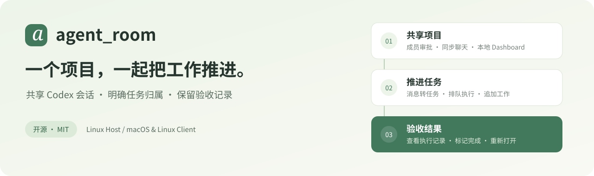
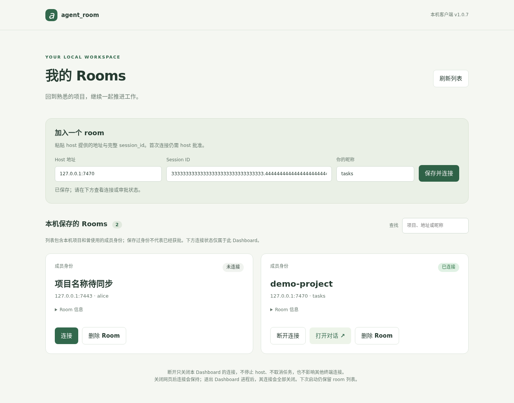
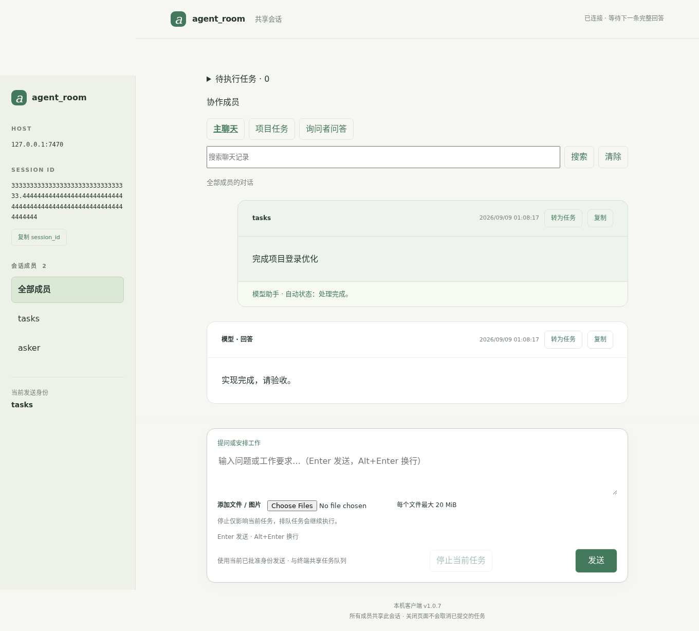
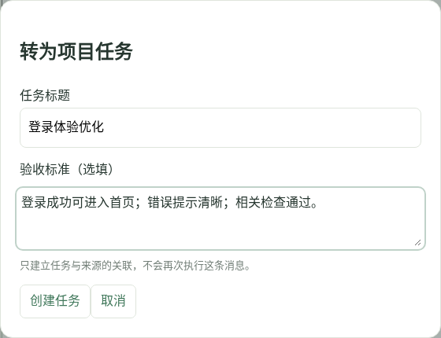
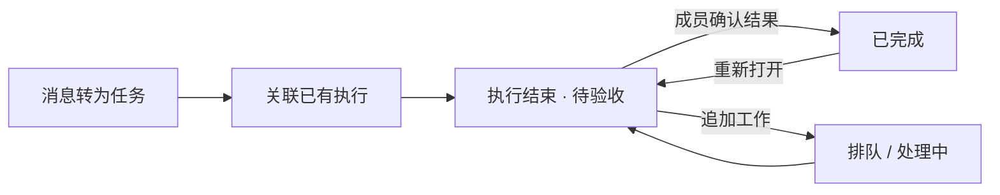
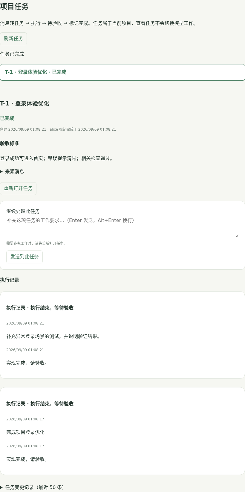
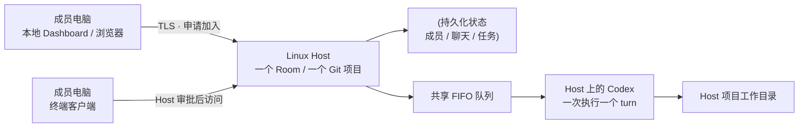

<p align="center">
  
</p>

<p align="center">
  <a href="https://www.npmjs.com/package/menmu-agent-room"></a>
  <a href="LICENSE"></a>
  
  
</p>

<p align="center">
  <a href="#快速开始">快速开始</a> ·
  <a href="#界面预览">界面预览</a> ·
  <a href="#任务怎么用">任务怎么用</a> ·
  <a href="#更新与常见问题">更新与常见问题</a> ·
  <a href="npm/README.md">English / CLI guide</a>
</p>

**agent_room 让可信协作者围绕同一个项目，共享 Codex 会话、执行队列和任务记录。**

在 Linux Host 的 Git 项目里启动一个 Room，其他人通过本地浏览器或终端申请加入。Host 审批后，大家可以一起讨论、安排工作、跟踪执行，再把结果交给成员验收。参与者无需 SSH 凭据、Host 系统账号或本机 Codex 安装。

> **一个 Room 对应一个项目，项目里可以有多个任务。** 任务保留来源与后续执行记录；模型执行结束进入「待验收」，由协作成员明确标记完成。
>
> 项目处于早期阶段，适用于可信协作者。协作成员提交的工作会使用 Host 执行者的权限访问项目，请先了解 [权限与信任边界](SECURITY.md)。

## 开发版：Codex 虚拟成员与飞书机器人

Codex Agent 作为项目虚拟成员显示工作状态。可选飞书机器人支持文字查询 Room 历史、显式派工和读取授权群消息；发送者绑定已有 Room 成员，结果私聊返回。此功能尚未发布 npm，配置与范围见[接入说明](docs/design/codex-virtual-member-feishu.md)。

## 1.0.11 更新

- 新增个人飞书文档补写：明确指定 docx 链接，发送者在本机核对账号、目标和正文后，追加到文档末尾，保留已有内容。
- 补写每次单独确认，不复用创建许可；相同请求保留回执，未知结果不自动重试。
- 创建与补写后回读正文核验，避免仅返回链接就报告完成；适当延长文档操作超时，并在取消时停止 CLI 子进程组。
- 资源授权面板可查看最近 10 次本机文档回执。旧版回执明确标注未验证正文。

Host 和客户端均需升级并重启。使用示例：“将准备好的正文补充到 https://你的租户/docx/文档ID”。目前仅支持末尾追加，不支持覆盖或段落替换；全文读取超过安全上限时保持待核实。真实飞书补写尚待发送者升级后验收。

```sh
npm install -g menmu-agent-room@1.0.11 --registry=https://registry.npmjs.org/
agent_room --version
```

## 1.0.10 更新

- 新增个人 GitHub 推送：发送者明确要求推送后，在自己的客户端核对 GitHub 账号、仓库、分支与提交，再确认执行。凭据留在发送者本机。
- 支持新建分支和快进更新，远端发生变化时停止；提供本机推送回执，结果待核实时不自动重试。
- 包含 1.0.9 的桌面界面优化与左上角项目名称展示。

发送者本机需要 Git 2.32+ 与 GitHub CLI，并使用 `gh auth login --hostname github.com --web` 登录。Host、Dashboard 和客户端都需升级并重启，正在执行任务时请先等待任务结束。使用流程与限制见[个人 GitHub 推送](docs/design/personal-github-push.md)。

```sh
npm install -g menmu-agent-room@1.0.10 --registry=https://registry.npmjs.org/
agent_room --version
```

## 1.0.9 更新

- 聊天页左上角显示当前项目名称，页面顶部与浏览器标签同步展示，方便区分多个项目。
- 项目名称来自 Host 的欢迎信息；Dashboard 打开的聊天页和终端 `answers` 入口均支持，重连时同步更新。
- 优化桌面 Dashboard 的项目卡片、连接状态、加入表单和操作层级，区分打开对话与删除 Room。
- 统一聊天页导航、消息间距、文字对比度、输入框与授权弹窗样式。

本次主要优化桌面使用体验，不改变成员权限、任务执行和个人资源授权流程。未新增数据库迁移。

```sh
npm install -g menmu-agent-room@1.0.9 --registry=https://registry.npmjs.org/
agent_room --version
```

持久化安装用户执行 `agent_room-update`。升级后退出并重启本机 Dashboard / 浏览器客户端，再打开对话；只刷新旧进程提供的网页不会加载新版 UI。Host 1.0.8 已提供项目名称数据，本次 UI 更新不要求中断正在执行任务的 Host。

## 1.0.8 更新

- 聊天页固定导航，滚动聊天时可直接切换成员视图和查看项目任务。
- Host 启动提供同网络只读欢迎页，展示项目信息、安装方法，并通过本机 Dashboard 检测与确认申请连接。
- 新增项目资源授权模式：默认 `host`，Host 可执行 `agent_room resource-mode personal` 切换为各成员本机授权。支持 GitHub、飞书和本机项目文本读取；面板结果默认个人可见，可主动带入主聊天草稿。
- 个人模式下，发送「创建 XX 飞书文档」会使用发送者本机飞书用户账号；缺少授权时向本人询问，凭据留在本机。
- 明确要求提交代码时，向发送者确认 Git 姓名、邮箱，Author 和 Committer 使用其确认署名；不修改 Host Git 配置。按指定整文件快照提交，保留其他文件的暂存内容。仅要求修改代码不自动提交。

Git 署名不代表 GitHub 身份认证；当前只创建本地未签名提交，不执行 hooks、不自动 push。提交前需完成项目检查，并核对同一文件是否含其他成员的修改。个人模式的专用通道校验发送者，但不会在系统层拦截任意 Host Shell/MCP；自然语言操作依赖模型路由指令。

Host、Dashboard 和客户端均需升级并重启；安装更新不会自动中断当前任务。资源面板的隔离总结有独立运行环境要求，详见 [个人资源授权说明](https://github.com/Doorwood/agent_room/blob/main/docs/design/personal-resource-authorization.md)。

```sh
npm install -g menmu-agent-room@1.0.8 --registry=https://registry.npmjs.org/
agent_room --version
```

持久化安装用户执行 `agent_room-update`。欢迎页的本机检测只能确认正在运行的新版 Dashboard，不能扫描已安装软件。


## 可以做什么

| 能力 | 你能获得什么 |
| --- | --- |
| **本地 Dashboard** | 按项目名称查找 Room，保存加入信息，连接、断开、打开对话或删除本机记录 |
| **共享聊天** | 查看成员发言、模型回答和时间；按成员筛选、搜索历史，向上加载更早消息 |
| **项目任务** | 将消息转为任务，填写验收标准，查看状态、追加工作、标记完成或重新打开 |
| **执行可见** | 查看排队情况与模型进度，停止当前执行；已排队工作继续按顺序处理 |
| **文件与图片** | 上传附件供 Host 处理，查看已发送附件、预览图片并下载文件 |
| **三种成员身份** | 协作成员安排工作，参观者只读查看，询问者在独立视图中提问 |
| **连续使用** | 保存成员身份、聊天记录和草稿；使用同一项目与状态重启 Host 后恢复 Room |

## 界面预览

以下截图来自 **1.0.7 的真实界面**，使用本地测试程序生成的演示项目、成员和消息；不连接真实 Codex，不展示真实凭据。页面随版本演进可能调整。

### 从 Dashboard 找到项目

启动 `agent_room dashboard`，添加 Host 地址、完整 session ID 和昵称。通过审批后，点击 Room 卡片上的 **「打开对话 ↗」** 进入聊天。



### 在同一个页面讨论、执行和回顾

主聊天展示成员消息与模型结果，保留时间和执行状态。**Enter 发送，Alt+Enter 换行**；模型回复中的网页链接可在新标签页打开。



## 快速开始

### 1. 安装客户端与 Host 命令

macOS / Linux，Node.js **20+**。推荐使用持久化安装，后续新终端也能直接使用：

```bash
npm exec --yes --registry=https://registry.npmjs.org/ --package=menmu-agent-room@latest -- agent_room-setup
export PATH="$HOME/.local/bin:$PATH"
agent_room --version
```

也可以使用全局 npm 安装，内含 macOS / Linux 的 x64、arm64 二进制，无需 Go 编译器：

```bash
npm install -g menmu-agent-room@latest --registry=https://registry.npmjs.org/
```

仓库和命令叫 **`agent_room`**，npm 包名是 **`menmu-agent-room`**。两种安装方式独立维护，后续请使用对应的更新命令。

### 2. Host：在项目中启动 Room

Host 需要 **Linux、Git 项目和已经登录的兼容 Codex CLI**。目前项目校验的 Codex CLI 版本为 `0.153.4`；Host 启动会检查 PATH 中的 Codex。模型配置和登录沿用 Host 环境，参与者无需另行配置模型密钥。详细准备方法见 [运行环境说明](npm/README.md#host-linux)。

```bash
cd /path/to/your-git-project
agent_room host .
```

终端会输出 Host 地址、`session_id` 和加入命令。Host 与参与者之间需要能访问对应 TCP 端口。

### 3. 参与者：打开 Dashboard，申请加入

在**自己的电脑**上运行并保持该进程运行：

```bash
agent_room dashboard
```

在本地页面填写 Host 地址、完整 session ID、昵称，提交加入申请。不要将本地聊天 URL 分享给其他人；每位成员应使用自己的客户端和身份加入。

偏好终端也可以直接使用：

```bash
agent_room join HOST_IP SESSION_ID --name alice

# 直接打开本地浏览器聊天客户端
agent_room answers HOST_IP SESSION_ID --name alice
```

### 4. Host：批准成员

在 Host 的同一项目目录另开一个终端：

```bash
agent_room requests
agent_room approve REQUEST_ID --role roommate
```

审批后客户端会自动继续连接。Dashboard 中点击 **「打开对话 ↗」**，即可开始协作。

## 任务怎么用

**任务入口位于 Room 的聊天页，不在 Dashboard 的 Room 列表页。** 只有协作成员可以创建和修改任务。

### ① 把消息转为任务

在主聊天的一条用户消息或模型回答旁点击 **「转为任务」**，填写标题和可选的验收标准。

<p align="center"></p>

转换只建立任务与消息的关联，**不会让模型重复执行原消息**。同一条工作消息及其回答、后续关联消息会定位到已有任务。

### ② 在「项目任务」里跟踪与验收

打开聊天页上方 **「项目任务」**，选中任务即可查看来源、状态、验收标准和执行记录。



*上图展示成功执行的常见流程。从笔记创建的任务可处于「待处理」；中断、失败和结果不确定会显示对应状态，不会自动标记完成。*



### ③ 有补充工作，继续归到同一个任务

在任务详情的 **「继续处理此任务」** 中输入要求，点击 **「发送到此任务」**。已完成任务先点击 **「重新打开任务」**。

- 模型执行结束只表示「待验收」；确认结果后，再点击 **「标记任务完成」**。
- 查看另一个任务不会改变当前模型的执行目标。
- 主聊天输入框提交普通消息；任务详情输入框才会把新工作归入所选任务。
- 任务仍共享项目会话、工作目录和队列，不提供独立 worktree、上下文隔离或文件差异快照。

完整状态与恢复行为见 [任务生命周期说明](docs/design/project-task-lifecycle.md)。

## 成员身份与权限

| 身份 | 主聊天与任务记录 | 安排工作、修改任务 | 只读问答 |
| --- | --- | --- | --- |
| **roommate · 协作成员** | 查看、搜索 | 可以 | 可查看询问者的问答记录 |
| **visitor · 参观者** | 查看、搜索聊天，查看任务 | 不可以 | 不可以 |
| **asker · 询问者** | 查看、搜索聊天，查看任务 | 不可以 | 在询问者视图提问，查看自己的问答 |

Host 在项目目录分配或调整身份：

```bash
agent_room approve REQUEST_ID --role visitor
agent_room approve REQUEST_ID --role asker
agent_room role REQUEST_ID --role roommate
agent_room revoke REQUEST_ID
```

询问者问答使用 Host 的共享 Codex 会话和只读沙箱，在单独视图展示；**视图分开不代表模型记忆隔离**。当扩展配置无法确认只读时，会拒绝问答。撤销身份会断开连接，但不会取消已经接受的工作。详情见 [权限设计](docs/design/roles-and-continuity.md)。

## 它如何工作



默认状态保存在 `~/.local/share/agent_room/projects`，按 Git 项目隔离。重启时使用相同项目和状态，复用已有会话与审批；自定义状态目录通过 `--state DIR` 指定。`session_id` 包含证书指纹，应完整复制；获得它只能申请加入，仍需要 Host 审批。

终端常用命令：`/status`、`/queue`、`/who`、`/diff`、`/note TEXT`、`/steer TEXT`、`/cancel`、`/quit`。执行和控制能力受成员角色限制。

## 更新与常见问题

### 怎么更新？

持久化安装用户：

```bash
agent_room-update --check
agent_room-update
```

全局 npm 安装用户：

```bash
npm install -g menmu-agent-room@latest --registry=https://registry.npmjs.org/
agent_room --version
```

**安装更新不会替换正在运行的进程。** Host 和参与者的客户端都要更新；在当前工作结束后停止旧 Host，用同一项目和状态重启。参与者也要退出旧 Dashboard / 客户端进程，重新启动并打开对话。

1.0.7 会把 Host 数据库迁移到 schema 5。升级前备份 Host 状态目录；迁移后的数据库不能直接由旧版 Host 打开。更多版本变化见 [Releases](https://github.com/Doorwood/agent_room/releases)。

### 更新了，却看不到「项目任务」？

1. 从 Dashboard 点击「打开对话 ↗」，任务功能在聊天页。
2. 查看聊天页底部版本，应为 **1.0.7 或更新版本**。
3. 确认 Host 也已更新并重启。`agent_room --version` 显示已安装命令的版本，不代表旧 Host 进程已切换。
4. 确认身份是协作成员；参观者与询问者不会显示「转为任务」。

### 关闭页面、断开连接、删除 Room 有什么区别？

- **关闭网页标签**：本地 Dashboard / 客户端进程仍可保持运行。
- **断开连接**：断开该 Dashboard 建立的连接，保留身份和已提交工作。
- **删除 Room**：删除本机保存的 Room 记录，不删除 Host 的项目或聊天历史。
- **停止当前任务**：中断当前模型执行，后续排队工作仍会继续。

### 连不上 Host 或启动失败？

检查 Host 地址与端口是否可达、session ID 是否完整、申请是否获批；用 `agent_room doctor` 检查本机实际使用的命令。Host 启动失败时，检查 PATH 中的 Codex 及其版本。Dashboard 负责连接和管理本机 Room 记录，不会替你启动 Host。

## 文档与开发

- [中文快速使用文档](docs/QUICKSTART.zh-CN.md)
- [English / CLI 安装与运维指南](npm/README.md)
- [任务生命周期](docs/design/project-task-lifecycle.md) · [成员权限设计](docs/design/roles-and-continuity.md)
- [贡献指南](CONTRIBUTING.md) · [安全说明](SECURITY.md) · [截图来源与复现](docs/images/README.md)

源码开发需要 Go **1.24+**、Node.js **20+** 和 Git：

```bash
go test ./...
go vet ./...
npm ci
npm run test:npm
node --test internal/answerwindow/group.test.mjs
npx playwright install chromium
npm run test:browser
```

`npm run pack:npm` 构建四个平台的二进制和 npm 包，不自动发布。Go module 与源码入口保留历史拼写 `agent_romm`；对外命令始终是 `agent_room`。[旧版 SSH 核心说明](docs/legacy-core-mvp.md)保留供维护参考。

## License

[MIT](LICENSE)。Codex 与第三方依赖分别遵循各自的许可和服务条款。


## 开发版：Agent 工作组

Room 现在区分人类领导组和 Agent 工作组。人类负责目标、权限与验收；Agent 负责执行。点击成员即可 @，也可发送 `@agent:builder @agent:reviewer 修复问题并复核`，由模型分析工作职责和依赖后交接结果。

- 用稳定 ID、Provider 和版本化 Assignment 协议接入不同 Agent。
- Codex 定向成员使用独立会话；其他服务可用 stdin/stdout JSON 适配器接入。
- 同项目串行执行，支持停止、结果归属、任务关联和重启后核对，不自动重放未知结果。
- 个人授权仍绑定真实人类发送者；询问者与参观者不会因分组显示获得派工权限。

[配置示例](docs/examples/agents.json) · [架构、接入协议与使用说明](docs/design/agent-workgroup.md)

此功能尚未发布到 npm，配置需使用包含该实现的新 Host。


### 邀请本机 Cursor / Claude Code（开发版）

在 Dashboard 连接 Room 后点击“邀请本机 Agent”，选择已安装的 Cursor 或 Claude Code 和执行权限。默认使用“Host 项目 · 任务独立副本”，无需填写本机项目目录。Agent 使用本机账号处理 Host 文件快照，结果回存 Host 独立目录，依赖任务可读取上游修改；主项目不会自动被覆盖。也可选择旧的“本机现有项目”模式。

[配置、权限与联调说明](docs/design/agent-workgroup.md#dashboard-邀请-cursor--claude-code)

### 用自然语言安排 Agent 协作

直接描述成员职责即可，例如：

```text
@agent:claude.a @agent:codex.b Claude 负责 review，Codex 实现登录优化并测试。
```

系统会分析出“Codex 开发 → Claude 评审”的依赖，**不按 @ 的先后顺序执行**。也可点击左侧 **描述协作目标**，用自然语言生成请求，或直接发送 `/team 让多个 Agent 协作完成登录优化并评审`。成员需已加入 Room。

规划使用独立进程、临时配置和只读模型会话，仅复用 Host Codex 文件登录，不加载 Host MCP 或主会话记忆；不需要填写依赖配置。计划通过成员、步骤与循环校验后自动执行，并在聊天展示。无法确定需求或规划无效时停止，提示澄清；只读模型能力不可用时也不会回退为未经规划的执行。普通单人问题继续使用原主会话。

支持多个上游依赖，同项目按依赖串行执行；失败、中断或结果未知会停止后续步骤。Host 副本模式会传递任务快照和上游变更；本机现有项目模式不传递文件。手动 JSON 编排保留在高级选项，详见 [Agent 工作组设计](docs/design/agent-workgroup.md)。


### Host 项目隔离副本（1.0.13）

受邀 Agent 默认从 Host 的 Git 工作区取得快照，包括未提交修改及未被忽略的新文件。在本机新建任务副本执行后，把修改回传到 Host 独立目录；每项任务使用不同目录，不覆盖其他 Agent 的结果或 Host 主项目。聊天结果提供工作副本和变更回执路径，供验收与后续合并。

后续依赖任务会组合上游变更：不同文件可以组合，同一文件冲突或 Host 基线变化会停止。主项目合并仍由人类安排，不自动提交或推送。快照目前最多 32 MiB / 10000 文件，不传 Git 元数据、忽略文件、`.env`、`.npmrc`、密钥目录或链接文件。依赖与运行环境需要在执行机器另行准备。

说明及边界见 [Host 项目隔离副本](docs/design/host-agent-workspaces.md)。

### 邀请本机 Codex 与成员命名（1.0.15）

Dashboard 的“邀请本机 Agent”支持 Codex、Cursor 和 Claude Code。选择已安装的 Agent，可填写名称（留空使用工具名称），Room 显示为“成员名称-Agent 名称”，例如 `lumos-代码评审`。成员名称由 Host 根据认证身份确定，@ 路由仍使用唯一成员 ID。

本机 Codex 使用邀请者机器上的 Codex 文件登录，每个步骤使用独立临时会话，不加载个人 MCP、插件或主会话。支持只读分析和编辑工作副本；默认 Host 项目副本沿用现有隔离、依赖产物交接机制。需在本机运行 `codex login`；不支持文件登录或隔离配置校验失败时明确拒绝，不改用 Host 登录。Host 和邀请者 Dashboard 都需要升级才能使用新邀请协议。
