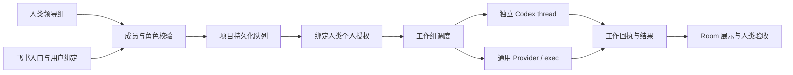

# Room：人类领导组与 Agent 工作组

## 已实现的使用方式（开发版，未发布 npm）

一个 Room 仍服务一个项目。人类提出目标、提供授权、验收成果；Agent 成员负责执行。人类已有 roommate / visitor / asker 权限保持不变，领导组的显示名称不提升参观者或询问者权限。

在 Host 上复制并编辑配置，启动一次后会保存到项目私有状态目录：

```bash
cp docs/examples/agents.json /tmp/my-room-agents.json
chmod 600 /tmp/my-room-agents.json
agent_room host . --agents-config /tmp/my-room-agents.json
```

后续启动 `agent_room host .` 自动加载本项目的 `private/agents.json`。Host 配置成员变更需要重启 Host；Dashboard 邀请的本机成员可在线加入和移除。正在运行的旧 Host 不会自动加载开发目录里的改动。

在群聊输入框点击工作组成员，会加入稳定 ID 的 @ 目标：

```text
@agent:builder 修复登录失败并执行测试
@agent:builder @agent:reviewer 修复登录失败，随后检查实现和测试是否充分
```

多个目标通过只读规划器根据原始自然语言分析依赖，不再按出现顺序执行。依赖步骤的产物交给下游。既可协作开发，也可依次分析、复核。只解析原始人类消息开头的 `@agent:id`；普通正文、引用和 Agent 输出中的 @ 不会自动启动其他 Agent。不写 @ 仍使用原来的 Codex 主会话。未知成员、重复目标、空工作内容会拒绝；一次最多 8 个目标，配置最多 16 个成员。

飞书文字入口沿用同一队列，可以发送 `/room 工作 @agent:builder @agent:reviewer 检查并修复…`，前提是飞书发送者已绑定有效 Room 成员且允许派工。飞书机器人是入口，不是独立的人类授权身份。

## 抽象与边界

- AgentMember：稳定 ID、展示名、Provider、描述、当前状态。没有人类 UID，不能成为审批者、提交署名或密钥所有者。
- Assignment v1：工作 ID、目标 Agent ID、真实人类 UID、项目根目录、项目任务 ID、原始授权提示、成员职责、明确的前序结果。
- Provider：`Run(context.Context, Member, Assignment) (Result, error)`。新增模型或服务只需提供适配器；执行队列、权限、任务生命周期与 UI 不依赖供应商协议。
- Runtime：把工作组作为复合执行器接到既有 Room Agent 接口，复用持久化接受、任务关联、取消和恢复流程。
- Result：归属 Agent 的文本产物；不能自行成为新的用户请求。最终是否验收通过仍由人类决定。

已提供以下适配器：

1. codex：复用 Host 的 Codex runtime，但每个定向成员、每次工作启动独立 thread，不混用主会话或其他成员记忆。跨成员仅传递本次工作的显式结果。未 @ 的消息保留原主会话行为。
2. cursor / claude-code：原生 CLI 适配，不需要自行编写 JSON 包装器。默认只读，可明确选择允许编辑，保留 CLI 权限检查。
3. remote：已批准的人类成员从本机 Dashboard 邀请的 Agent，通过加密连接领取工作和回传结果。
4. exec：Host 管理者预先安装并配置的本地适配进程。直接执行绝对路径及参数数组，不通过 shell 拼接命令；用 stdin/stdout JSON 接入其他模型或远程 Agent 服务。

协作支持自然语言分析依赖和 /team 显式依赖计划，同一项目只执行一个工作组。没有让多个 Agent 并行修改同一工作区，也没有自行协商、循环派工或无限重试。未来并行策略必须先引入隔离工作区、冲突合并和验收节点，不能简单并发调用 Provider。

## 扩展实现

Go 内嵌适配器可通过 `NewWithProviders(..., map[string]Provider{"remote": adapter})` 注册。配置与注册表在启动时校验并复制，不允许运行中的聊天更换 Provider；纯外部程序优先使用 exec 协议，不必修改调度层。



## 通用进程适配协议

成员配置示例（将命令换成已安装的真实适配器）：

```json
{"id":"research","name":"Research Agent","provider":"exec","command":["/absolute/path/to/my-agent-adapter"],"timeoutSeconds":600}
```

每次执行收到一份 JSON：

```json
{"version":1,"assignmentId":"32hex","agentId":"research","humanUid":123,"projectRoot":"/workspace/project","taskId":4,"prompt":"人类工作要求和本次授权约束","instructions":"成员职责","priorResults":[{"agentId":"builder","text":"上一步的产物"}]}
```

stdout 仅输出一份 JSON `{"text":"执行结果"}`，非零退出、无效 JSON、空正文或超过 64 KiB 输出视为失败，后续成员不启动。stderr 不写入 Room。默认每步超时 1800 秒，可配置 1–7200 秒；取消会终止进程组并等待退出。

适配器是 Host 管理者安装的可信代码，并非操作系统沙箱。进程不继承 Host 的 token、SSH agent socket 或其他环境变量；执行环境只有固定 PATH/LANG。适配器若需自己的凭据，由其部署者在授权边界内配置，禁止从聊天指定命令或把个人密钥上传 Host。read-only 职责提示不是强制文件系统隔离，不应把不可信程序当只读 Agent 运行。

## 权限与数据

所有请求先经过已有成员角色检查，沿用实际人类发送者；Agent 名字或返回文本无法改变发送者。个人模式中授权指令由 personal 包绑定到该人类工作请求，工作组接收到同一任务范围的约束，不切换成 Host 身份。每次需要个人提交、推送、飞书写入时仍走原来的专用通道和确认规则。

主队列持久化原始消息（含 @ 目标），工作组独立 journal 持久化复合 turn、已确认结果与终态，结果进入 Room 聊天并关联原项目任务。询问者只读路径直接走原执行器，不使用派工路由，也不把私有问答交给工作组。

成员配置由 Host 管理者控制。Agent ID 重命名相当于新增身份，不要在待执行队列中途重新分配已有 ID 的含义。

## 生命周期、异常与恢复

人类派工 → Room 排队 → 工作组运行 → 各成员顺序处理 → 待人类验收。成员结果展示实际 Agent 名称和 ID，不能把第一个成员回复当成整个任务完成。

开始前先写 journal，结果先持久化再广播，所有成员完成后才结束复合 turn。普通失败或明确取消停止后续成员。Host 重启会读取 journal 核对已完成结果；运行中但缺少终态的工作由既有恢复流程标为需确认，不自动重放已有副作用。底层 Codex 中断结果无法证实时冻结队列，需要人工核对并恢复；不会假装已停止后继续安排其他写操作。

当前每次工作使用新 thread，不持久续接定向成员的聊天记忆；journal 是执行回执，不是 Agent 私有记忆库。没有声称任意第三方 CLI 无需适配即可使用；真实外部模型和飞书联调需在相应授权环境验收。


## Dashboard 邀请 Cursor / Claude Code

在运行 Dashboard 的机器上安装并登录 Cursor CLI（cursor-agent）或 Claude Code（claude）。检测只确认可执行程序存在，不把它当作登录成功。

1. 以获批的协作成员身份连接 Room，点击该 Room 的“邀请本机 Agent”。
2. 选择已检测到的 CLI。默认使用 Host 项目隔离副本；选择本机现有项目模式时才填写本机目录。
3. 选择只读分析或允许编辑工作副本，确认允许 Room 协作成员向此 Agent 派工。
4. Room 工作组会出现对应的 `@agent:w用户UID-邀请ID`，直接点击即可加入草稿，支持与 Host Codex 或其他 Agent 顺序协作。
5. Dashboard 可移除 Agent；断开该 Room 或退出 Dashboard 时取消本机执行。关闭浏览器页不会关闭 Dashboard 进程，因此也不会自动停止工作。

Host 副本模式传输项目快照和任务修改，返回 Host 独立目录；不同任务不共享可写目录，主项目不自动合并。旧的本机现有项目模式仍不传文件。成员本机使用自己的 CLI 登录配置，凭据不会上传 Host。Host 原生成员仍使用 Host 项目目录。

跨机器派工不会携带 Host 的个人操作 capability 或私有执行路径，只传递原始人类请求与本次协作的公共结果。远程成员不代替发送者进行 Git 提交、推送或外部账号写入；这些操作仍交给支持原有个人授权通道的 Host 执行器。

原生 CLI 默认不启用全权限绕过。Claude 编辑模式自动允许 Read/Glob/Grep/Edit/Write，未授权的 shell 等操作不能自动执行；Cursor 编辑模式使用 CLI 的 auto-review。需要额外权限或 CLI 不支持所需参数时返回未完成结果，不自动重试。CLI 是用户信任的本机程序，不提供额外 OS 沙箱。

连接使用已有证书固定的 TLS 与 Room 成员凭证；注册、领取、完成都重新校验当前角色和 worker 所有者。90 秒租约由 Dashboard 每 2 秒续期；任务领取后失联属于结果未知，Host 冻结队列供核对，不重新派发。Host 重启后邀请不自动恢复，需重新邀请；旧执行的恢复仍以项目 journal 为准。

### Host 原生成员配置示例

```json
{"version":1,"members":[
 {"id":"codex","name":"Codex Agent","provider":"codex"},
 {"id":"cursor","name":"Cursor","provider":"cursor","mode":"review"},
 {"id":"claude","name":"Claude Code","provider":"claude-code","mode":"review"}
]}
```

### 验证记录

已覆盖原生命令参数、成功结果判定、拒绝权限后的失败处理、TLS 邀请与角色校验、跨成员拒绝领取/伪造结果、大结果传输、Host capability 剥离、Dashboard 本机目录执行与断开停止，以及浏览器邀请表单。协议端到端测试使用受控 CLI fixture，不能替代真实模型联通验证。

本次 Host 检测到 Cursor 2026.09.02-c22c1a3，登录查询显示 authenticated。实际只读模型调用未通过：原 CLI 发生连接重试并返回 WritableIterable is closed，新适配器实测也未取得成功结果。尚未验证真实 Claude Code 模型调用。可显式运行只读 Cursor 验证：

```bash
AGENT_ROOM_LIVE_CURSOR_TEST=1 go test ./internal/workgroup -run TestLiveCursorReadOnlyFixture -v -count=1 -timeout=140s
```

协议依据：[Cursor 输出格式](https://docs.cursor.com/en/cli/reference/output-format)、[Claude Code 非交互运行](https://code.claude.com/docs/en/headless)，具体可用参数同时以执行机器的 CLI --help 为准。

## 显式步骤依赖（本次新增）

Room 左侧“描述协作目标”的高级选项可选择成员、填写步骤 ID / 工作内容 / 依赖步骤，生成草稿后由人类发送。主聊天与项目任务的继续处理输入框都可使用。成员 ID 支持 `claude.a`、`codex.b` 这样的点号命名；必须是实际配置或邀请后的成员 ID，界面直接选择即可。

也可发送以下命令（示例中的成员需要先加入 Room）：

```text
/team {"steps":[{"id":"develop","agent":"codex.b","prompt":"实现登录优化并运行测试"},{"id":"claudereview","agent":"claude.a","prompt":"检查开发步骤结果与代码差异，给出审查结论","dependsOn":["develop"]}]}
```

- Step 与 Agent 分离：一个成员可执行多个步骤；每个步骤有唯一 ID、成员、任务描述与 dependsOn。
- 多上游汇合：`dependsOn:["backend","frontend"]` 表示两个上游都成功后才能执行。即使 review 写在 develop 前面，也会按依赖排序。
- 1–16 步；严格校验未知成员、重复 ID、缺失依赖、自依赖、重复依赖、循环与多余字段。只有原始人类消息开头的 `/team` 会解析，Agent 输出不能新建流程。
- 同项目仍串行调度：在原计划中选择首个依赖就绪的步骤，不并发修改工作区。任一步失败或中断，停止整组剩余步骤；未启动步骤标记 blocked。上游结果不确定时进入 unknown 核对流程，不重复派发。
- 只交接直接依赖的结果，结果携带 stepId 和 agentId；独立分支不会自动收到无关分支的输出。如需更早步骤产物，请显式加入依赖。
- Provider 的 Assignment 增加 stepId、stepPrompt、dependsOn；Codex / Claude Code / Cursor 根据本步骤职责工作，exec 自定义适配器需读取这些字段。真实 humanUid、TaskID 与个人权限约束不变。
- 计划及步骤状态保存在工作组 runs.db 的 workflows 表；每次调用 Provider 前先持久化 running，成功结果持久化后才能解锁下游。最终聊天记录包含各步骤状态，重启读取已有执行记录，不自动重放。
- 本机现有项目模式只交接文本；Host 隔离副本模式还交接上游文件变更。如果开发与评审位于不同机器，请让评审可访问对应代码版本；否则只能基于交接文本分析。完成步骤表示执行成功，不代表人类已验收项目任务。
- `/team` 后为完整 JSON，不在 JSON 后追加自由文本或附件清单；工作要求写入每个步骤的 prompt。

验证覆盖乱序依赖、多上游汇合、同成员多步骤、无关结果隔离、失败与 unknown 阻断、持久化回执以及页面编排/循环校验/访客权限。多 @ 的消息入口保持兼容，但顺序改由自然语言规划器分析。


## 自然语言依赖规划（默认入口）

用户只说目标与职责，例如“claude.a 负责 review，codex.b 开发登录功能”。不要求填写步骤、配置依赖或使用 JSON。多个真实成员 ID / 名称、@agent、协作请求会进入规划；页面“描述协作目标”生成 `/team 自然语言要求` 可显式进入规划。普通问题仍走主会话。手工步骤表仅为可选高级入口。

规划器使用独立 app-server 进程和临时 Codex 配置目录，仅复用 Host 的 Codex 文件登录，以真实成员的公开目录和原始人类消息为输入，不传个人 capability 或命令配置。输出步骤与 dependsOn；评审依赖被评审产物，不以提及顺序替代语义。成员描述也只是数据，不能扩大人类授权。工作步骤继续绑定原始发送者、原始要求和权限约束。

规划结果需要通过严格 JSON、成员存在性、步骤 ID、依赖与循环校验。通过后展示计划并持久化执行；模型请求澄清、结构无效、能力不支持或调用失败时不派发任何工作步骤。不自动退回按 @ 顺序执行，不要求用户自行补依赖配置。规划最多两分钟，可被停止；读写不确定状态仍进入原有核对流程。

规划不加载 Host 的 MCP、项目配置或主会话：禁用 shell、exec、apps、plugins、hooks、搜索和记忆，使用空工作目录及临时只读线程，并校验有效配置与 MCP 列表。Host 的正常工作工具保持原样；配置隔离或文件登录不可用时停止规划，不回退主会话。规划线程与主会话隔离，后续工作不共享规划器的隐式会话状态，只消费校验后的步骤和依赖。

回归测试新增：评审先被提及但开发先运行、规划只走只读调用且不携带个人 capability、无效成员/循环/澄清均不执行工作、页面默认自然语言而不是依赖表。

Host 项目副本实现及隔离边界见 [host-agent-workspaces.md](host-agent-workspaces.md)。

## 单成员直达修复

单独在开头 @ 一个成员时直接派发，不调用只读协作规划器。单独 @agent:codex 使用原项目主会话并保留发送者授权上下文；单独 @ 其他成员直接运行对应适配器。多成员或显式 /team 自然语言才需要规划。该修复避免 Host 加载 MCP 时单成员任务也被只读规划校验拒绝。
